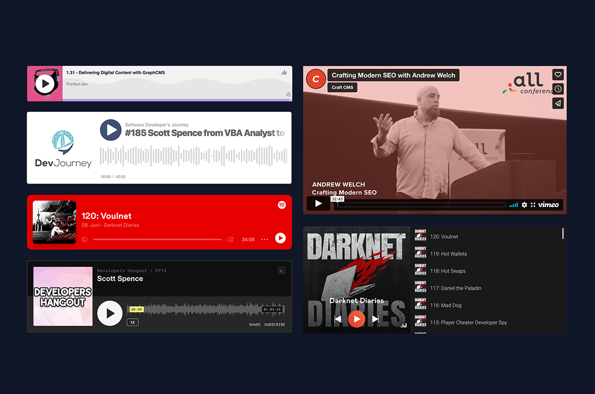

# SvelteKit Embed

<!-- ALL-CONTRIBUTORS-BADGE:START - Do not remove or modify this section -->

[](#contributors-)

<!-- ALL-CONTRIBUTORS-BADGE:END -->

[](https://madewithsvelte.com/p/sveltekit-embed/shield-link)

This is a collection of embed components I use on a regular basis
packaged up for use.



Each component with the exception of `Toot` and `Tweet` is wrapped in
an intersection observer `GeneralObserver` which will load up the
component when it scrolls into the viewport.

## Use

```bash
npm i -D sveltekit-embed
```

Use like a normal Svelte component:

```html
<script>
  import { AnchorFm } from 'sveltekit-embed'
</script>

<AnchorFm
  height="165"
  episodeUrl="purrfect-dev/embed/episodes/1-31---Delivering-Digital-Content-with-GraphCMS-e14g55c/a-a650v9a"
/>
```

## Got questions?

[Start a discussion](https://github.com/spences10/sveltekit-embed/discussions/new)

## Something not work?

Create an
[issue](https://github.com/spences10/sveltekit-embed/issues/new)

## Todo

- [ ] Add more components
- [ ] Tests... need adding
- [ ] If you know how to type a custom action in Svelte, please submit
      a PR

## Developing locally

Import the component locally into the `index.md` file:

```svelte
import MyComponent from '$lib/components/my-component.svelte'
```

Test the package locally with the `package:local` script:

```bash
npm run package:local
```

And add it to the import statement in the `index.md` file:

```svelte
import { MyComponent } from 'sveltekit-embed'
```

Test locally, then submit a PR 🙏

If you're adding a new component to be used in the package then add an
export to the `src/lib/index.ts` file.

## Thanks

Credit to [@pauliescanlon](https://github.com/pauliescanlon) for the
original version of this project in
[MDX Embed](https://github.com/pauliescanlon/mdx-embed).

## Packaging for NPM

Scott, this is here for you to remember how to do this 🙃

Although I detailed this in
[Making npm Packages with SvelteKit](https://scottspence.com/posts/making-npm-packages-with-sveltekit)
I think it's best to put it here as I always come to the README and
the instructions are never there! 😅

**Publish the project to NPM**

```bash
# authenticate with npm
npm login
# bump version with npm
npm version 0.0.2
# package with sveltkit
pnpm run package
# publish from package directory
cd package
npm publish
```

## Contributors ✨

Thanks goes to these wonderful people
([emoji key](https://allcontributors.org/docs/en/emoji-key)):

<!-- ALL-CONTRIBUTORS-LIST:START - Do not remove or modify this section -->
<!-- prettier-ignore-start -->
<!-- markdownlint-disable -->
<table>
  <tbody>
    <tr>
      <td align="center"><a href="https://scottspence.com/"><br /><sub><b>Scott Spence</b></sub></a><br /><a href="https://github.com/spences10/sveltekit-embed/commits?author=spences10" title="Code">💻</a></td>
      <td align="center"><a href="https://github.com/Cahllagerfeld"><br /><sub><b>Cahllagerfeld</b></sub></a><br /><a href="https://github.com/spences10/sveltekit-embed/commits?author=Cahllagerfeld" title="Code">💻</a></td>
      <td align="center"><a href="https://matiashernandez.dev/"><br /><sub><b>Matías Hernández Arellano</b></sub></a><br /><a href="https://github.com/spences10/sveltekit-embed/commits?author=matiasfha" title="Code">💻</a></td>
    </tr>
  </tbody>
  <tfoot>
    
  </tfoot>
</table>

<!-- markdownlint-restore -->
<!-- prettier-ignore-end -->

<!-- ALL-CONTRIBUTORS-LIST:END -->

This project follows the
[all-contributors](https://github.com/all-contributors/all-contributors)
specification. Contributions of any kind welcome!
